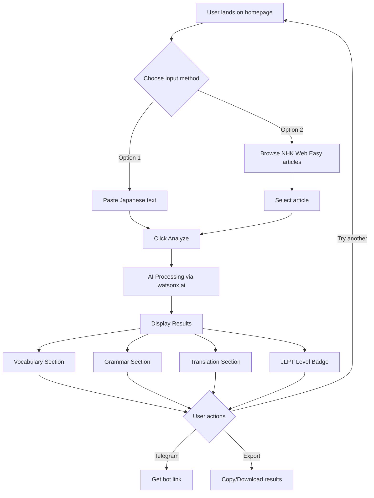
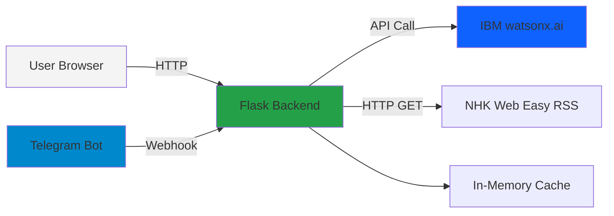

# やさしい先生 (Yasashii Sensei) - IBM Bob Hackathon Technical Brief

**AI-Powered Japanese Learning Assistant**  
**Target: 48-Hour Hackathon Delivery**  
**Last Updated: 2026-05-15**

---

## 1. Product Vision

### Problem Statement
Japanese learners struggle to understand authentic Japanese content (news articles, social media, literature) because:
- Dictionary lookups are time-consuming and context-unaware
- Grammar explanations are scattered across multiple resources
- Cultural nuances are often missed entirely
- Difficulty assessment is subjective and inconsistent
- No integrated learning path from comprehension to practice

### Target Users
- **Primary**: Intermediate Japanese learners (JLPT N4-N3) seeking real-world practice
- **Secondary**: Beginners (N5) using simplified content (NHK Web Easy)
- **Tertiary**: Advanced learners (N2-N1) wanting cultural depth

### Why This Matters
Traditional language learning apps focus on artificial exercises. Real fluency comes from engaging with authentic content. Yasashii Sensei bridges the gap between textbook Japanese and real-world usage by providing instant, contextual AI assistance.

### Competitive Advantage
- **IBM watsonx.ai Granite**: Enterprise-grade AI with superior context understanding
- **Integrated workflow**: From content discovery (NHK RSS) to comprehension testing
- **Cultural intelligence**: Not just translation, but cultural context
- **Telegram integration**: Learn anywhere, anytime
- **Zero friction**: No signup, no database, instant value

---

## 2. Core Features

### MVP Features (Must-Have for Demo)
1. **Text Analysis Interface**
   - Paste any Japanese text
   - Receive instant AI-powered breakdown
   - Display vocabulary, grammar, translation

2. **Sample Articles ("Today's Articles")**
   - 5 curated hardcoded Japanese articles
   - Covering N5 to N2 difficulty levels
   - One-click analysis
   - Displayed in web UI and Telegram bot
   - **Note**: NHK Web Easy requires authentication - using hardcoded samples instead
   - See [`SAMPLE_ARTICLES_SPEC.md`](SAMPLE_ARTICLES_SPEC.md) for full article content

3. **AI-Powered Explanations**
   - Vocabulary with context-aware definitions
   - Grammar pattern identification
   - JLPT level estimation
   - English translation

4. **Web Interface**
   - Clean, modern UI
   - Mobile-responsive
   - Japanese typography support

5. **Telegram Bot** ⭐ CORE FEATURE
   - Send Japanese text via Telegram
   - Receive formatted analysis
   - Mobile-first learning
   - Share same Flask backend as web app
   - Must be demo-ready alongside web interface

### Stretch Features (If Time Permits)
6. **Comprehension Questions**
   - AI-generated questions
   - Test understanding
   - Adaptive difficulty

7. **Cultural Notes**
   - Context-specific cultural explanations
   - Honorifics usage
   - Social context

8. **Follow-up Recommendations**
   - Suggest related NHK articles
   - Progressive difficulty

### Features to AVOID (Scope Creep)
- ❌ User accounts/authentication
- ❌ Progress tracking/analytics
- ❌ Spaced repetition system
- ❌ Flashcard generation
- ❌ Audio/pronunciation features
- ❌ Community features
- ❌ Database persistence (use in-memory caching only)

---

## 3. User Flow

### Primary Flow: Text Analysis



### Step-by-Step User Journey

**Scenario: Beginner analyzing NHK Web Easy article**

1. User opens `http://localhost:5000`
2. Sees clean interface with two options:
   - "Paste Japanese Text" textarea
   - "Browse NHK Web Easy" button
3. Clicks "Browse NHK Web Easy"
4. Sees list of 5-10 recent articles with titles and dates
5. Clicks article: "東京で新しい美術館がオープン"
6. Article text auto-populates in textarea
7. Clicks "Analyze with AI" button
8. Loading spinner appears (2-5 seconds)
9. Results page displays:
   - **Header**: Original text with furigana
   - **JLPT Badge**: "Estimated Level: N4"
   - **Vocabulary**: 10-15 key words with definitions
   - **Grammar**: 3-5 grammar patterns explained
   - **Translation**: Natural English translation
   - **Cultural Notes**: Context about Japanese museums
10. User scrolls, reads, learns
11. Clicks "Analyze Another" to return to homepage

---

## 4. Technical Architecture

### System Overview



### Component Breakdown

#### Frontend
- **Technology**: Vanilla HTML/CSS/JavaScript (or lightweight React if team prefers)
- **Styling**: Custom CSS with Japanese typography focus
- **Fonts**: Noto Sans JP (Google Fonts)
- **Responsive**: Mobile-first design
- **No build step**: Keep it simple for hackathon

#### Backend (Flask)
- **Framework**: Flask 3.x
- **Structure**: Single `app.py` for MVP (can split later)
- **Dependencies**:
  - `flask` - Web framework
  - `ibm-watsonx-ai` - IBM AI SDK
  - `requests` - HTTP client for RSS
  - `feedparser` - RSS parsing
  - `python-telegram-bot` - Telegram integration (CORE MVP)
  - `python-dotenv` - Environment variables
- **No ORM**: No database needed
- **Caching**: Simple in-memory dict for NHK articles (TTL: 1 hour)

#### AI Integration (watsonx.ai)
- **Primary Model**: `ibm/granite-4-h-small` (optimized for speed and efficiency)
- **Fallback Model**: `meta-llama/llama-3-3-70b-instruct` (if primary fails)
- **Banned Models**: `mistral-medium-2505` (NOT allowed for this hackathon)
- **SDK**: `ibm-watsonx-ai` Python package
- **Authentication**: API key via environment variable
- **Endpoint**: `https://us-south.ml.cloud.ibm.com`
- **Prompt Engineering**: Structured prompts for each analysis type
- **Error Handling**: Graceful fallbacks with model switching

#### Telegram Integration (CORE MVP FEATURE)
- **Library**: `python-telegram-bot`
- **Mode**: Webhook (for production) or polling (for local dev)
- **Commands**:
  - `/start` - Welcome message
  - `/help` - Usage instructions
  - `/nhk` - Get latest NHK article
  - Direct text message - Analyze Japanese text

#### NHK Web Easy RSS
- **Source**: `https://www3.nhk.or.jp/news/easy/news-easy.xml`
- **Parsing**: `feedparser` library
- **Caching**: Store parsed articles in memory (refresh every hour)
- **Fields**: Title, link, description, publication date

---

## 5. Full Folder Structure

```
yasashii-sensei/
├── app.py                          # Main Flask application
├── requirements.txt                # Python dependencies
├── .env.example                    # Environment variable template
├── .env                           # Actual environment variables (gitignored)
├── .gitignore                     # Git ignore file
├── README.md                      # Project documentation
├── YASASHII_SENSEI_BOB_BRIEF.md  # This file
│
├── config/
│   └── prompts.py                 # watsonx.ai prompt templates
│
├── services/
│   ├── __init__.py
│   ├── watsonx_service.py         # watsonx.ai integration
│   ├── nhk_service.py             # NHK RSS fetching
│   └── telegram_service.py        # Telegram bot (stretch)
│
├── utils/
│   ├── __init__.py
│   ├── text_processor.py          # Japanese text utilities
│   └── cache.py                   # Simple in-memory cache
│
├── static/
│   ├── css/
│   │   └── style.css              # Main stylesheet
│   ├── js/
│   │   └── app.js                 # Frontend JavaScript
│   └── images/
│       └── logo.png               # App logo
│
├── templates/
│   ├── base.html                  # Base template
│   ├── index.html                 # Homepage
│   └── results.html               # Analysis results page
│
└── tests/                         # Optional: Basic tests
    ├── test_watsonx.py
    └── test_nhk.py
```

### File Explanations

**Root Level:**
- `app.py`: Main Flask app with all routes. Keep simple for hackathon.
- `requirements.txt`: Pin versions for reproducibility.
- `.env.example`: Template for required environment variables.

**`config/`:**
- `prompts.py`: Centralized prompt templates. Easy to iterate during hackathon.

**`services/`:**
- `watsonx_service.py`: Encapsulates all watsonx.ai API calls.
- `nhk_service.py`: Handles RSS fetching and parsing.
- `telegram_service.py`: Telegram bot logic (if implemented).

**`utils/`:**
- `text_processor.py`: Helper functions for Japanese text (character counting, basic tokenization).
- `cache.py`: Simple TTL cache implementation.

**`static/`:**
- Standard Flask static files structure.
- Keep CSS minimal and focused.

**`templates/`:**
- Jinja2 templates for server-side rendering.
- Alternative: Single-page app with API endpoints.

---

## 6. API Design

### REST Endpoints

#### 1. Homepage
```
GET /
Returns: HTML page (index.html)
Purpose: Main landing page
```

#### 2. Analyze Text
```
POST /api/analyze
Content-Type: application/json

Request:
{
  "text": "東京で新しい美術館がオープンしました。",
  "options": {
    "include_cultural_notes": true,
    "include_questions": false,
    "jlpt_estimation": true
  }
}

Response:
{
  "success": true,
  "data": {
    "original_text": "東京で新しい美術館がオープンしました。",
    "jlpt_level": "N4",
    "vocabulary": [
      {
        "word": "美術館",
        "reading": "びじゅつかん",
        "meaning": "art museum, art gallery",
        "context": "A place where art is displayed for public viewing",
        "jlpt_level": "N4"
      }
    ],
    "grammar": [
      {
        "pattern": "〜で",
        "explanation": "Particle indicating location of action",
        "example": "東京で (in Tokyo)"
      }
    ],
    "translation": "A new art museum opened in Tokyo.",
    "cultural_notes": [
      "Japanese museums often have special opening ceremonies..."
    ],
    "comprehension_questions": []
  },
  "processing_time_ms": 2341
}

Error Response:
{
  "success": false,
  "error": "Invalid Japanese text",
  "message": "The provided text does not contain Japanese characters."
}
```

#### 3. Fetch NHK Articles
```
GET /api/nhk/articles
Query Parameters:
  - limit: int (default: 10, max: 20)
  - refresh: bool (default: false)

Response:
{
  "success": true,
  "data": {
    "articles": [
      {
        "id": "k10014012345000",
        "title": "東京で新しい美術館がオープン",
        "description": "東京の上野に新しい美術館が...",
        "link": "https://www3.nhk.or.jp/news/easy/k10014012345000/...",
        "published": "2026-05-15T10:00:00Z",
        "preview": "東京の上野に新しい美術館がオープンしました..."
      }
    ],
    "cached": true,
    "cache_expires_at": "2026-05-15T11:00:00Z"
  }
}
```

#### 4. Health Check
```
GET /api/health

Response:
{
  "status": "healthy",
  "services": {
    "watsonx": "connected",
    "nhk_rss": "available"
  },
  "timestamp": "2026-05-15T18:22:00Z"
}
```

---

## 7. watsonx.ai Prompt Engineering

### Combined Analysis Prompt (Recommended for MVP)

```python
SYSTEM_CONTEXT = """You are Yasashii Sensei (やさしい先生), an expert Japanese language teacher specializing in helping learners understand authentic Japanese content. You provide clear, contextual explanations suitable for learners at various JLPT levels."""

COMBINED_ANALYSIS_PROMPT = """
{system_context}

Perform a comprehensive analysis of the following Japanese text for language learners.

Japanese Text:
{japanese_text}

Provide:
1. JLPT level estimation (N5, N4, N3, N2, or N1)
2. Key vocabulary (5-15 words with readings, meanings, context, JLPT level)
3. Important grammar patterns (3-7 patterns with explanations and examples)
4. Natural English translation
5. Cultural notes (if applicable)

Return ONLY valid JSON in this exact format:
{{
  "jlpt_level": "N4",
  "vocabulary": [
    {{
      "word": "美術館",
      "reading": "びじゅつかん",
      "meaning": "art museum",
      "context": "Refers to the new museum opening",
      "jlpt_level": "N4"
    }}
  ],
  "grammar": [
    {{
      "pattern": "〜で",
      "explanation": "Location particle indicating where action occurs",
      "example": "東京で (in Tokyo)",
      "jlpt_level": "N5"
    }}
  ],
  "translation": "A new art museum opened in Tokyo.",
  "cultural_notes": [
    "Museum openings in Japan are significant cultural events often attended by local officials."
  ]
}}

IMPORTANT: Return ONLY the JSON object. No additional text before or after.
"""
```

### Prompt Engineering Best Practices

1. **JSON-Only Responses**: Always request JSON-only output to simplify parsing
2. **Clear Structure**: Provide exact JSON schema in prompt
3. **Context First**: Include system context about being a Japanese teacher
4. **Specific Instructions**: Be explicit about what to include/exclude
5. **Error Handling**: Handle cases where AI returns non-JSON or malformed JSON
6. **Token Efficiency**: Use combined prompt for MVP to reduce API calls

### Implementation Example

```python
# services/watsonx_service.py
from ibm_watsonx_ai import Credentials
from ibm_watsonx_ai.foundation_models import ModelInference
import json

class WatsonxService:
    # Model configuration
    PRIMARY_MODEL = "ibm/granite-4-h-small"
    FALLBACK_MODEL = "meta-llama/llama-3-3-70b-instruct"
    BANNED_MODELS = ["mistral-medium-2505"]  # NOT allowed for this hackathon
    
    def __init__(self, api_key, project_id):
        self.credentials = Credentials(
            api_key=api_key,
            url="https://us-south.ml.cloud.ibm.com"
        )
        self.project_id = project_id
        self.current_model = self.PRIMARY_MODEL
        self.model = ModelInference(
            model_id=self.current_model,
            credentials=self.credentials,
            project_id=self.project_id
        )
    
    def analyze_text(self, japanese_text):
        prompt = COMBINED_ANALYSIS_PROMPT.format(
            system_context=SYSTEM_CONTEXT,
            japanese_text=japanese_text
        )
        
        response = self.model.generate(
            prompt=prompt,
            params={
                "max_new_tokens": 2000,
                "temperature": 0.3,
                "top_p": 0.9
            }
        )
        
        result_text = response['results'][0]['generated_text']
        
        try:
            return json.loads(result_text)
        except json.JSONDecodeError:
            return self._extract_json(result_text)
```

---

## 8. Environment Variables

### `.env` File Template

```bash
# IBM watsonx.ai Configuration
WATSONX_API_KEY=your_watsonx_api_key_here
WATSONX_PROJECT_ID=your_project_id_here
WATSONX_URL=https://us-south.ml.cloud.ibm.com
WATSONX_PRIMARY_MODEL=ibm/granite-4-h-small
WATSONX_FALLBACK_MODEL=meta-llama/llama-3-3-70b-instruct

# Flask Configuration
FLASK_ENV=development
FLASK_DEBUG=True
SECRET_KEY=your_secret_key_for_sessions

# NHK Web Easy RSS
NHK_RSS_URL=https://www3.nhk.or.jp/news/easy/news-easy.xml
NHK_CACHE_TTL=3600

# Telegram Bot (REQUIRED - Core MVP Feature)
TELEGRAM_BOT_TOKEN=your_telegram_bot_token
TELEGRAM_WEBHOOK_URL=https://your-domain.com/api/telegram/webhook

# Application Settings
MAX_TEXT_LENGTH=5000
DEFAULT_JLPT_LEVEL=N4
ENABLE_CULTURAL_NOTES=true
ENABLE_COMPREHENSION_QUESTIONS=false
```

### Environment Variable Descriptions

| Variable | Required | Description | Default |
|----------|----------|-------------|---------|
| `WATSONX_API_KEY` | ✅ Yes | IBM Cloud API key for watsonx.ai | - |
| `WATSONX_PROJECT_ID` | ✅ Yes | watsonx.ai project ID | - |
| `WATSONX_URL` | ✅ Yes | watsonx.ai API endpoint | `https://us-south.ml.cloud.ibm.com` |
| `WATSONX_PRIMARY_MODEL` | ✅ Yes | Primary AI model | `ibm/granite-4-h-small` |
| `WATSONX_FALLBACK_MODEL` | ✅ Yes | Fallback AI model | `meta-llama/llama-3-3-70b-instruct` |
| `FLASK_ENV` | No | Flask environment mode | `development` |
| `FLASK_DEBUG` | No | Enable Flask debug mode | `True` |
| `SECRET_KEY` | No | Flask session secret key | Random string |
| `NHK_RSS_URL` | No | NHK Web Easy RSS feed URL | NHK official URL |
| `NHK_CACHE_TTL` | No | Cache time-to-live in seconds | `3600` (1 hour) |
| `TELEGRAM_BOT_TOKEN` | ✅ Yes | Telegram bot API token (CORE MVP) | - |
| `TELEGRAM_WEBHOOK_URL` | No | Telegram webhook URL | - |
| `MAX_TEXT_LENGTH` | No | Maximum input text length | `5000` |
| `DEFAULT_JLPT_LEVEL` | No | Default JLPT level for UI | `N4` |

**IMPORTANT NOTE**: The model `mistral-medium-2505` is BANNED for this hackathon and must never be used.

---

## 9. 48-Hour Build Plan

### Phase 1: Foundation (Hours 0-8)

**Hour 0-2: Project Setup**
- [ ] Initialize Git repository
- [ ] Create folder structure
- [ ] Set up Python virtual environment
- [ ] Install dependencies (`requirements.txt`)
- [ ] Configure `.env` file
- [ ] Test watsonx.ai connection
- [ ] Create basic `app.py` with Flask

**Hour 2-4: Core Backend**
- [ ] Implement `watsonx_service.py`
- [ ] Create prompt templates in `prompts.py`
- [ ] Build `/api/analyze` endpoint
- [ ] Test with sample Japanese text
- [ ] Add error handling

**Hour 4-6: NHK Integration**
- [ ] Implement `nhk_service.py`
- [ ] Create RSS parser
- [ ] Build `/api/nhk/articles` endpoint
- [ ] Implement simple caching
- [ ] Test with live NHK feed

**Hour 6-8: Basic Frontend**
- [ ] Create `base.html` template
- [ ] Build `index.html` homepage
- [ ] Add basic CSS styling
- [ ] Implement text input form
- [ ] Test end-to-end flow

**Milestone 1**: Basic text analysis working end-to-end

### Phase 2: Core Features (Hours 8-20)

**Hour 8-12: Results Display**
- [ ] Create `results.html` template
- [ ] Design vocabulary display component
- [ ] Design grammar explanation component
- [ ] Add translation section
- [ ] Implement JLPT level badge
- [ ] Add loading states

**Hour 12-16: NHK Article Browser**
- [ ] Build article list UI
- [ ] Add article preview cards
- [ ] Implement article selection
- [ ] Auto-populate textarea with article
- [ ] Add "Analyze" button integration
- [ ] Test full NHK flow

**Hour 16-20: Telegram Bot Integration (CORE MVP)**
- [ ] Set up Telegram bot with BotFather
- [ ] Implement `telegram_service.py`
- [ ] Create webhook endpoint
- [ ] Format responses for Telegram
- [ ] Test bot commands (`/start`, `/help`, `/nhk`)
- [ ] Test direct text message analysis
- [ ] Ensure bot shares same backend as web app

**Milestone 2**: MVP complete with web interface AND Telegram bot

### Phase 3: Enhancement (Hours 20-32)

**Hour 20-24: Polish & Refinement**
- [ ] Improve CSS styling
- [ ] Add Japanese typography (Noto Sans JP)
- [ ] Implement responsive design
- [ ] Add error messages
- [ ] Improve loading indicators
- [ ] Test on mobile devices
- [ ] Test Telegram bot on actual devices

**Hour 24-28: Cultural Notes (Stretch)**
- [ ] Add cultural notes prompt
- [ ] Update analysis endpoint
- [ ] Design cultural notes UI component
- [ ] Add cultural notes to Telegram responses
- [ ] Test with various content types

**Hour 28-32: Comprehension Questions (Stretch)**
- [ ] Implement question generation prompt
- [ ] Add questions to analysis response
- [ ] Create interactive question UI
- [ ] Add questions to Telegram bot
- [ ] Add answer reveal functionality

**Milestone 3**: Stretch features implemented

### Phase 4: Demo Preparation (Hours 32-44)

**Hour 32-36: Testing & Bug Fixes**
- [ ] Test all user flows
- [ ] Fix critical bugs
- [ ] Test with various Japanese content
- [ ] Verify NHK RSS reliability
- [ ] Test error scenarios
- [ ] Performance optimization

**Hour 36-40: Demo Content Preparation**
- [ ] Select 5-7 demo Japanese texts
- [ ] Prepare demo script
- [ ] Create demo video/screenshots
- [ ] Write README with setup instructions
- [ ] Document API endpoints
- [ ] Prepare presentation slides

**Hour 40-44: Final Polish**
- [ ] UI/UX improvements
- [ ] Add demo mode (pre-loaded examples)
- [ ] Optimize watsonx.ai prompts
- [ ] Add analytics/logging
- [ ] Final testing

**Milestone 4**: Demo-ready application

### Phase 5: Buffer & Presentation (Hours 44-48)

**Hour 44-46: Buffer Time**
- [ ] Address any remaining issues
- [ ] Last-minute improvements
- [ ] Backup deployment
- [ ] Practice demo

**Hour 46-48: Presentation Prep**
- [ ] Finalize presentation
- [ ] Rehearse demo
- [ ] Prepare Q&A responses
- [ ] Submit project

### Critical Path Items

**Must Complete:**
1. watsonx.ai integration (granite-4-h-small primary, llama fallback)
2. Text analysis endpoint
3. NHK RSS integration
4. Basic web UI
5. Results display
6. **Telegram bot (CORE MVP)**

**Should Complete:**
7. Cultural notes
8. Mobile responsiveness
9. Error handling
10. Telegram bot demo video

**Nice to Have:**
11. Comprehension questions
12. Advanced UI features
13. Follow-up recommendations

---

## 10. UI/UX Direction

### Visual Style

**Design Philosophy:**
- Clean, minimal, learner-focused
- Japanese aesthetic with modern web design
- Calm, encouraging, not overwhelming
- Mobile-first approach

**Color Palette:**
```css
/* Primary Colors */
--primary-blue: #0f62fe;      /* IBM Blue - trust, technology */
--primary-green: #24a148;     /* Success, learning progress */
--primary-red: #da1e28;       /* Alerts, important notes */

/* Japanese-Inspired Accents */
--sakura-pink: #ffb3d9;       /* Soft, welcoming */
--matcha-green: #7cb342;      /* Natural, calming */
--indigo-blue: #3f51b5;       /* Traditional Japanese indigo */

/* Neutrals */
--text-primary: #161616;      /* Main text */
--text-secondary: #525252;    /* Secondary text */
--background: #f4f4f4;        /* Page background */
--surface: #ffffff;           /* Cards, containers */
--border: #e0e0e0;            /* Borders, dividers */
```

**Typography:**
```css
/* Japanese Text */
font-family: 'Noto Sans JP', 'Hiragino Sans', 'Yu Gothic', sans-serif;

/* English Text */
font-family: 'Inter', 'Segoe UI', system-ui, sans-serif;

/* Sizes */
--text-xs: 0.75rem;   /* 12px - labels */
--text-sm: 0.875rem;  /* 14px - body small */
--text-base: 1rem;    /* 16px - body */
--text-lg: 1.125rem;  /* 18px - emphasis */
--text-xl: 1.25rem;   /* 20px - headings */
--text-2xl: 1.5rem;   /* 24px - page titles */
```

### Learner-Friendly Interactions

1. **Progressive Disclosure**
   - Show vocabulary first (most important)
   - Collapse grammar by default
   - Expand on click

2. **Visual Hierarchy**
   - JLPT level badge prominent
   - Color-coded difficulty (N5=green, N1=red)
   - Icons for each section (📚 vocab, 📖 grammar, 🌐 translation)

3. **Loading States**
   - Animated spinner during AI processing
   - Progress indicator: "Analyzing vocabulary... 📚"
   - Estimated time: "This usually takes 3-5 seconds"

4. **Error Handling**
   - Friendly error messages
   - Suggestions for fixing issues
   - Example: "Hmm, we couldn't detect Japanese text. Try pasting text with hiragana, katakana, or kanji."

5. **Mobile Optimization**
   - Large touch targets (min 44px)
   - Swipeable cards
   - Bottom navigation
   - Sticky analyze button

---

## 11. Demo Strategy

### Best Demo Flow (5-7 minutes)

**1. Opening Hook (30 seconds)**
- "Learning Japanese from real content is hard. Let me show you how AI makes it easy."
- "Learn anywhere - on the web OR on your phone via Telegram"

**2. Web Interface Demo (2 minutes)**
- Navigate to Yasashii Sensei web app
- Click "Browse NHK Web Easy"
- Select article: "東京で新しい美術館がオープン"
- Click "Analyze with AI"
- **Wow Moment #1**: Fast AI processing with granite-4-h-small (2-3 seconds)
- Show comprehensive breakdown: vocabulary, grammar, translation, JLPT level

**3. Telegram Bot Demo (2 minutes)** ⭐ CORE FEATURE
- Pull out phone
- Open Telegram bot
- Send Japanese text: "今日のランチ超美味しかった！"
- **Wow Moment #2**: Instant mobile analysis
- Show formatted response in Telegram
- Demonstrate `/nhk` command for article suggestions
- "Same AI backend, works everywhere"

**4. Custom Text Demo (1 minute)**
- Return to web interface
- Paste custom text (tweet, manga excerpt)
- Show versatility across content types

**5. Technical Highlight (1 minute)**
- "Powered by IBM watsonx.ai Granite 4H Small"
- "Fallback to Llama 3.3 70B for reliability"
- Show architecture: one Flask backend, two interfaces
- Emphasize speed and accuracy

**6. Closing (30 seconds)**
- Recap: "Web + Mobile, powered by IBM AI"
- "From confusion to comprehension in seconds, anywhere"

### Sample Japanese Content to Showcase

**Beginner (N5-N4):**
```
今日は天気がいいです。
公園で友達と遊びました。
とても楽しかったです。
```

**Intermediate (N3-N2):**
```
東京で新しい美術館がオープンしました。
この美術館では、日本の伝統的な芸術作品と
現代アートの両方を見ることができます。
```

**Social Media/Casual:**
```
今日のランチ超美味しかった！😋
新しくできたラーメン屋さん、マジでおすすめ！
```

---

## 12. Risk Reduction Strategy

### Features to AVOID

**❌ User Authentication**
- **Why**: Adds complexity, no value for demo
- **Alternative**: Open access, no login required

**❌ Database Persistence**
- **Why**: Overkill for hackathon, deployment complexity
- **Alternative**: In-memory caching only

**❌ Complex State Management**
- **Why**: Time-consuming, error-prone
- **Alternative**: Simple request/response pattern

**❌ Microservices Architecture**
- **Why**: Over-engineering for 48 hours
- **Alternative**: Monolithic Flask app

**❌ Advanced NLP Processing**
- **Why**: Reinventing the wheel
- **Alternative**: Let watsonx.ai handle it

### Acceptable Shortcuts for Hackathon

**✅ Hardcoded Configuration**
- Store prompts in Python files, not database
- Acceptable for demo

**✅ Simple Error Handling**
- Generic error messages
- No detailed logging infrastructure

**✅ Mock Data Fallbacks**
- If NHK RSS fails, use cached examples
- If watsonx.ai is slow, show pre-generated results

**✅ Minimal Testing**
- Manual testing only
- No unit tests required

**✅ Basic Styling**
- Use CSS framework (Bootstrap/Tailwind) if needed
- Don't spend hours on pixel-perfect design

### Mock/Stub Candidates if Time is Limited

**Priority 1: Must Work**
- watsonx.ai text analysis (granite-4-h-small)
- Basic web interface
- Text input/output
- **Telegram bot (CORE MVP - cannot be mocked)**

**Priority 2: Should Work**
- NHK RSS integration
- Results formatting
- Mobile responsiveness
- Telegram bot demo video

**Priority 3: Can Mock**
- Comprehension questions (pre-generate examples)
- Cultural notes (optional feature)
- Follow-up recommendations

### Contingency Plans

**If watsonx.ai is slow:**
- Cache common responses
- Show loading messages
- Pre-generate demo results

**If NHK RSS is unavailable:**
- Use cached articles
- Provide manual text input only
- Show pre-loaded examples

**If time runs short:**
- Focus on core text analysis
- Simplify Telegram bot (basic text analysis only, skip /nhk command)
- Use simpler UI design
- Skip comprehension questions
- Skip cultural notes

### Success Metrics for Demo

**Minimum Viable Demo:**
1. ✅ Paste Japanese text (web)
2. ✅ Get AI analysis back (granite-4-h-small)
3. ✅ Display vocabulary + translation
4. ✅ Show JLPT level
5. ✅ **Telegram bot basic text analysis**

**Good Demo:**
6. ✅ NHK article integration (web)
7. ✅ Grammar explanations
8. ✅ Clean, responsive UI
9. ✅ Fast performance (<5s)
10. ✅ **Telegram bot /nhk command**

**Excellent Demo:**
11. ✅ Cultural notes
12. ✅ **Telegram bot demo video**
13. ✅ Comprehension questions
14. ✅ Polished UX
15. ✅ Model fallback working (llama-3-3-70b)

---

## Implementation Priorities

### Day 1 Focus
1. Get watsonx.ai working
2. Build basic Flask API
3. Create simple web interface
4. Test end-to-end flow

### Day 2 Focus
1. Add NHK integration
2. Polish UI/UX
3. Add stretch features (if time)
4. Prepare demo

### Key Success Factors
- **Start simple**: Get MVP working first
- **Iterate quickly**: Don't over-engineer
- **Test early**: Catch issues fast
- **Focus on demo**: What looks good matters
- **Use AI wisely**: Let watsonx.ai do the heavy lifting

---

## Next Steps

1. **Review this brief** with your team
2. **Set up development environment** (Python, watsonx.ai credentials)
3. **Assign roles** (backend, frontend, AI prompts, demo prep)
4. **Start with Phase 1** of the build plan
5. **Check in every 4-6 hours** to assess progress
6. **Pivot if needed** - stay flexible

**Remember**: The goal is a working demo that showcases IBM watsonx.ai capabilities for language learning. Focus on what works, not what's perfect.

Good luck! 🚀 がんばって！

---

## Appendix A: .env.example File

Create this file in the project root:

```bash
# IBM watsonx.ai Configuration
WATSONX_API_KEY=
WATSONX_PROJECT_ID=
WATSONX_URL=https://us-south.ml.cloud.ibm.com
WATSONX_PRIMARY_MODEL=ibm/granite-4-h-small
WATSONX_FALLBACK_MODEL=meta-llama/llama-3-3-70b-instruct

# Flask Configuration
FLASK_ENV=development
FLASK_DEBUG=True
SECRET_KEY=change_this_to_random_string

# NHK Web Easy RSS
NHK_RSS_URL=https://www3.nhk.or.jp/news/easy/news-easy.xml
NHK_CACHE_TTL=3600

# Telegram Bot (REQUIRED - Core MVP Feature)
TELEGRAM_BOT_TOKEN=
TELEGRAM_WEBHOOK_URL=

# Application Settings
MAX_TEXT_LENGTH=5000
DEFAULT_JLPT_LEVEL=N4
ENABLE_CULTURAL_NOTES=true
ENABLE_COMPREHENSION_QUESTIONS=false
```

---

## Appendix B: config/prompts.py File

Create this file to centralize all AI prompts:

```python
"""
Prompt templates for watsonx.ai Granite model
Model: ibm/granite-4-h-small (primary)
Fallback: meta-llama/llama-3-3-70b-instruct
BANNED: mistral-medium-2505
"""

# Model Configuration
PRIMARY_MODEL = "ibm/granite-4-h-small"
FALLBACK_MODEL = "meta-llama/llama-3-3-70b-instruct"
BANNED_MODELS = ["mistral-medium-2505"]

# System Context
SYSTEM_CONTEXT = """You are Yasashii Sensei (やさしい先生), an expert Japanese language teacher specializing in helping learners understand authentic Japanese content. You provide clear, contextual explanations suitable for learners at various JLPT levels."""

# Combined Analysis Prompt (Recommended for MVP)
COMBINED_ANALYSIS_PROMPT = """
{system_context}

Perform a comprehensive analysis of the following Japanese text for language learners.

Japanese Text:
{japanese_text}

Provide:
1. JLPT level estimation (N5, N4, N3, N2, or N1)
2. Key vocabulary (5-15 words with readings, meanings, context, JLPT level)
3. Important grammar patterns (3-7 patterns with explanations and examples)
4. Natural English translation
5. Cultural notes (if applicable)

Return ONLY valid JSON in this exact format:
{{
  "jlpt_level": "N4",
  "vocabulary": [
    {{
      "word": "美術館",
      "reading": "びじゅつかん",
      "meaning": "art museum",
      "context": "Refers to the new museum opening",
      "jlpt_level": "N4"
    }}
  ],
  "grammar": [
    {{
      "pattern": "〜で",
      "explanation": "Location particle indicating where action occurs",
      "example": "東京で (in Tokyo)",
      "jlpt_level": "N5"
    }}
  ],
  "translation": "A new art museum opened in Tokyo.",
  "cultural_notes": [
    "Museum openings in Japan are significant cultural events often attended by local officials."
  ]
}}

IMPORTANT: Return ONLY the JSON object. No additional text before or after.
"""

# Model Parameters
MODEL_PARAMS = {
    "max_new_tokens": 2000,
    "temperature": 0.3,
    "top_p": 0.9,
    "repetition_penalty": 1.1
}
```

---

## Appendix C: Quick Start Checklist

### Pre-Development Setup
- [ ] Clone/create repository
- [ ] Set up Python virtual environment (`python -m venv venv`)
- [ ] Activate virtual environment
- [ ] Install dependencies (`pip install -r requirements.txt`)
- [ ] Copy `.env.example` to `.env`
- [ ] Add IBM watsonx.ai credentials to `.env`
- [ ] Create Telegram bot with BotFather
- [ ] Add Telegram bot token to `.env`
- [ ] Test watsonx.ai connection
- [ ] Test Telegram bot connection

### Development Workflow
1. **Day 1 Morning (Hours 0-8)**
   - Backend foundation
   - watsonx.ai integration
   - NHK RSS integration
   - Basic web UI

2. **Day 1 Afternoon/Evening (Hours 8-20)**
   - Results display
   - NHK article browser
   - **Telegram bot integration (CORE)**
   - Polish and refinement

3. **Day 2 Morning (Hours 20-32)**
   - Cultural notes (stretch)
   - Comprehension questions (stretch)
   - Testing and bug fixes

4. **Day 2 Afternoon/Evening (Hours 32-48)**
   - Demo preparation
   - Telegram bot demo video
   - Presentation materials
   - Final polish

### Critical Success Factors
✅ **watsonx.ai working** with granite-4-h-small  
✅ **Telegram bot functional** (cannot be skipped)  
✅ **NHK RSS integration** working  
✅ **Web interface** clean and responsive  
✅ **Demo video** showing both web and Telegram  
✅ **Fast performance** (<5 seconds per analysis)  

### Red Flags to Avoid
❌ Using mistral-medium-2505 (BANNED)  
❌ Skipping Telegram bot (it's CORE MVP)  
❌ Over-engineering with database  
❌ Spending too much time on UI polish  
❌ Not testing on actual mobile devices  
❌ Missing the demo video deadline  

---

## Final Notes

This technical brief is your roadmap for the 48-hour hackathon. Key takeaways:

1. **Telegram bot is NOT optional** - it's a core MVP feature alongside the web interface
2. **Use granite-4-h-small as primary model** with llama-3-3-70b as fallback
3. **Never use mistral-medium-2505** - it's banned for this hackathon
4. **Focus on demo quality** over production scalability
5. **Both interfaces share one Flask backend** - efficient architecture
6. **Test early and often** - especially the Telegram bot on real devices
7. **Prepare demo video** showing both web and mobile experiences

**Remember**: The goal is a working demo that showcases IBM watsonx.ai capabilities for Japanese language learning across web and mobile platforms. Stay focused, iterate quickly, and deliver a polished experience.

がんばってください！Good luck! 🚀